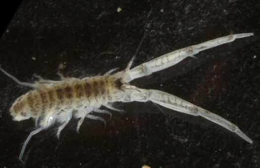
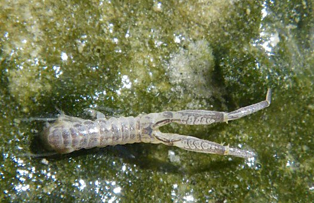

```{r setup, include = FALSE}
knitr::opts_chunk$set(
  collapse = TRUE,
  comment = NA_character_
)
options(dplyr.width = 100, width = 100)
# see e-mail Kurt Hornik 2019-03-05T12:59
suppressWarnings(RNGversion("3.5.0"))
set.seed(314)
```

<br/>
<br/>

## Introduction

The `benthos`-package provides functions for analysing benthic data sets.
To use the `benthos` package, some basic knowledge of programming in R (R Core Team, 2017; www.r-project.org) is assumed. 

The functions in the `benthos`-package have been designed to integrate seamlessly with those of the `dplyr`-package (Wickham _et al._, 2017). The `dplyr`-package implements a grammar of data manipulation to make data analysis more efficient and clear. 

The `benthos`-package is designed to use the forward-pipe operator (`%>%`) provided by the `magrittr`-package (Milton Bache & Wickham, 2014). This operator can be used for chaining multiple data operations together. This reduces the need for temporary variables or nested function calls and leads to cleaner and more readable code. Consult the references below and the corresponding package vignettes for more information.

The `benthos`-package follows the same philosophy as the `dplyr` package: in stead of providing complicated functions that can do many tasks ('Swiss army knife'-functions), we provide a set of _'small functions that each do one thing well'_ (Wickham & Francois, 2017; 'Introduction to `dplyr` vignette'). As a consequence, you will not find functions in this package which perform a complete analysis, rather it provides basic building blocks that you can use to build your own functions and applications.


<br/>

## Loading the package

The `benthos`-package can be attached by means of
```{r}
library(benthos)
```

In this vignette, we also attach the `dplyr`, `tidyr`, `readr` and `ggplot2` packages for data manipulation and visualization.

```{r, message=FALSE}
library(dplyr)
library(tidyr)
library(readr)
library(ggplot2)
```

<br/>

## Sample data set


In the sections below, we will illustrate the `benthos`-package by means of the Oosterschelde marine benthos data set. This data set ships with the `benthos`-package and can be loaded by typing:

```{r}
data(oosterschelde)
```

The first 10 records  of these data set are given below:
```{r}
oosterschelde
```

Type
```{r, eval=FALSE}
?oosterschelde
```
to see the documentation of this data set.
<br/>


## Preprocessing

Data preprocessing is an important first step. In this section we will demonstrate some preprocessing steps.

<br/>


### Selecting variables and observations

As a simple preprocessing step, we will only consider samples (stored in rows) taken in August and September. These can be selected as follows:

```{r}
oosterschelde <- oosterschelde %>%
    filter(months(DATE) %in% c("August", "September"))
```

<br/>

### Standardization of taxon names

Taxon names need to be standardized to comply with the names in the WoRMS-database. The `as_accepted`-function does this conversion by using the TWN-list (http://sofus.ecosys.nl/taxabase.htm). This list is based on the WoRMS database (World Register of Marine Species, http://www.marinespecies.org).

We can use the `is_accepted`-function to check if a taxon complies with WoRMS:

```{r}
oosterschelde %>% 
    mutate(COMPLIANT = is_accepted(taxon = TAXON)) %>%
    select(OBJECTID, HABITAT, DATE, TAXON, COUNT, COMPLIANT)
```
This returns a logical vector with `TRUE` if a taxon complies with WoRMS and `FALSE` otherwise. The total number of records, compliant names, and missing names is given below
```{r}
oosterschelde %>% 
    mutate(COMPLIANT = is_accepted(taxon = TAXON)) %>%
    summarise(
        N_RECORDS = n(),
        N_COMPLIANT = sum(COMPLIANT),
        N_MISSING = N_RECORDS - N_COMPLIANT
    )
```

Taxa not compliant with WoRMS (if any) are given below and will be removed:
```{r}
oosterschelde %>% 
    filter(!is_accepted(taxon = TAXON))
oosterschelde <- oosterschelde %>% 
    filter(is_accepted(taxon = TAXON))
```

Other examples of the usage of the `is_accepted` and `as_accepted`-functions are:
```{r}
is_accepted(taxon = "Petricola pholadiformis")
as_accepted(taxon = "Petricola pholadiformis")
is_accepted(taxon = "Petricolaria pholadiformis")
```

If we want to make sure that all taxa names comply with WoRMS we simply use:
```{r}
oosterschelde <- oosterschelde %>%
    mutate(TAXON = as_accepted(TAXON))
```


Taxon names that are not in the WoRMS/TWN-list get name `NA` (not available):
```{r}
oosterschelde %>% 
    filter(!is_accepted(taxon = TAXON)) %>%
    nrow
```
In our case all names comply with those in WoRMS.


<br/>

### Genus to species conversion

Genus to species conversion reallocates the counts of taxa that are identified at the genus level to taxa in the same sampling unit and of the same genus but that are identified on the species level. The redistribution of counts is proportional to the number of counts of taxa at the species level (Van Loon _et al_., 2015). 

The Oosterschelde data set only contains individuals at the genus and species level (individuals at higher order taxonomic levels have been removed for didactic purposes only).

It is convenient to split each taxon into its generic and specific name. This can be accomplished as follows:

```{r}
oosterschelde <- oosterschelde %>%
    mutate(
        GENERIC  = generic_name(TAXON),
        SPECIFIC = specific_name(TAXON)
    )
oosterschelde
```

Both functions `generic_name` and `specific_name` return `NA` if TAXON is not a valid binomial. That is the case if a taxon has only been identified on the genus level. For example:

```{r}
is_binomen("Nephtys")
is_binomen("Nephtys cirrosa")
```

We will create a new column to indicate these cases.

```{r}
oosterschelde <- oosterschelde %>%
    mutate(
        IS_GENUS = is.na(GENERIC),
        GENERIC = ifelse(IS_GENUS, TAXON, GENERIC)
    )
```

The number of taxa that has been identified at the genus level is
```{r}
oosterschelde %>%
    filter(IS_GENUS) %>%
    nrow
```


Genus to species conversion is performed for each genus in a sample by means of the `genus_to_species` function:

```{r}
oosterschelde <- oosterschelde %>%
    group_by(ID, GENERIC) %>%
    mutate(NEWCOUNT = genus_to_species(is_genus = IS_GENUS, count = COUNT)) %>%
    ungroup
```




_Corophium arenarium_ (left) and  _Corophium volutator_ (right) (source: http://nature22.com)


To illustrate the algorithm, consider all records with generic name _Corophium_ in sample 130: 
```{r}
oosterschelde %>%
    filter(GENERIC == "Corophium", ID == 130) %>%
    arrange(TAXON)
```


In this sample, the genus _Corophium_ is identified 19 times at the species level, _i.e._, 17 times as _Corophium arenarium_ and twice as _Corophium volutator_. For five individuals, the analyst was unable to identify the species name, and only reported the genus. The genus to species algorithm now proportionally reallocates the $5$ individuals at the genus level to the taxa at the species level. That is, an additional $5 \times \frac{17}{17 + 2} = `r round(5 * 17/(17 + 2), 2)`$ individuals will be classified as _Corophium arenarium_ and $5 \times \frac{2}{17 + 2} = `r round(5 * 2/(17 + 2), 2)`$ as _Corophium volutator_.

Note that the total number of species will _not_ be affected:

```{r}
oosterschelde %>%
    summarise(sum(COUNT), sum(NEWCOUNT))
```

To finalize our analysis, we will set COUNT to the value of NEWCOUNT, and remove redundant columns and records.
```{r}
oosterschelde <- oosterschelde %>%
    mutate(COUNT = NEWCOUNT) %>%
    select(ID, HABITAT, AREA, DATE, TAXON, COUNT) %>%
    filter(COUNT > 0)
oosterschelde
```

<br/>

### Data pooling

Analysis results make only sense when all sampling units are collected on the same support. That is not the case for the oosterschelde data:

```{r}
d <- oosterschelde %>%
    group_by(AREA) %>%
    summarise(n = n())
d
```

We distinguish three different supports (`r toString(d$AREA)` m<sup>2</sup>). In this section, we will demonstrate how to pool these data to approximately the same support in the range from 0.09 to 0.11 m<sup>2</sup>. See Van Loon _et al._ (2015) for more details.

We will only pool samples of the same year, so we'll start by adding a new column to our table containing the year:

```{r}
oosterschelde <- oosterschelde %>%
    mutate(YEAR = DATE %>% format("%Y"))
```

Next, we will randomly pool samples for each HABITAT and YEAR. We will pool several times (in the example below `n_pool_runs = 10`), to reduce the effect of pool composition and to make sure that each sample will be represented in a pool (no leftovers on average).

```{r}
n_pool_runs <- 10
pool_runs <- replicate(
    n = n_pool_runs, {
    oosterschelde %>% 
        group_by(HABITAT, YEAR) %>%
        mutate(
            POOLID = pool(
                sample_id = ID, 
                area = AREA, 
                target_area = c(0.09, 0.11)
            )
        ) %>%
        ungroup %>%
        select(POOLID)
    }
)
```

This procedure will return al list of pool identifiers (POOLID) for each pool run:

```{r}
names(pool_runs) <- paste0("POOLRUN", 1:n_pool_runs)
pool_runs <- pool_runs %>% as_tibble
pool_runs
```
Each row in this table corresponds to the row with the same index in `oosterschelde`. Therefore, it is quite easy to combine this table with the 'oosterschelde' data:
```{r}
oosterschelde_orig <- oosterschelde
oosterschelde <- oosterschelde %>%
    bind_cols(pool_runs) %>% 
    as_tibble 
oosterschelde
```
It was not always possible to use all samples for pooling. These 'leftover' samples have POOLID `NA`. However, on average each sample has been pooled between `r rowSums(!is.na(pool_runs)) %>% range %>% paste(collapse = " and ")` times.

For further analysis, it is convenient to convert this table from 'wide' to 'long'-format. This can be done efficiently by functions of the `tidyr`-package (Wickham, 2017), which provides an interesting framework to tidy your data (Wickham, 2014).
```{r}
oosterschelde <- oosterschelde %>% 
    gather(key = "POOLRUN", value = "POOLID", starts_with("POOLRUN")) %>%
    mutate(POOLRUN = parse_number(POOLRUN) %>% as.integer) %>%
    filter(!is.na(POOLID)) %>%
    select(POOLRUN, POOLID, HABITAT, AREA, YEAR, ID, TAXON, COUNT)
oosterschelde
```

To check if the pooling algorithm succeeded in its task, we compute the area of each pool. These areas should vary between 0.09 and 0.11 m<sup>2</sup>, _i.e._, our target area.

```{r}
d <- oosterschelde %>%
    group_by(HABITAT, YEAR, POOLRUN, POOLID) %>%
    select(ID, AREA) %>%
    distinct(ID, AREA) %>%
    summarise(AREA = sum(AREA))
d
```

The following code computes the frequencies of the available areas:

```{r}
d <- d %>%
    select(AREA) %>%
    group_by(AREA) %>%
    summarise(n = n()) %>%
    arrange(AREA)
d
```
This is also visualized in the bar graph below. All the pooled areas are nicely within the target area demarcated by the red lines.

```{r, fig.retina=NULL, fig.width=5, fig.height=3, out.width=500, echo=FALSE}
ggplot(data = d) +
    geom_vline(xintercept = c(0.09, 0.11), colour = "red", size = 1, alpha = 0.5) +
    geom_linerange(
        mapping = aes(x = AREA, ymin= 0, ymax = n),
        colour = "seashell4", size = 2
    ) +
    scale_x_continuous(name = "area pooled sample (m2)")
```

The pooled samples can be used to estimate biodiversity measures (see the next section for details). For instance, the species richness for each pool is given by:

```{r}
d <- oosterschelde %>%
    group_by(HABITAT, YEAR, POOLRUN, POOLID) %>%
    summarise(S = species_richness(taxon = TAXON, count = COUNT))
d
```

The annual mean species richness for each habitat and year is given by:

```{r}
d <- d %>%
    group_by(HABITAT, YEAR) %>%
    summarise(S = mean(S))
d
```


<br/>
<br/>


## Biodiversity measures

Several biodiversity measures have been implemented in the `benthos`-package. In the sections below, we will demonstrate how to calculate these measures. To simplify things, all analysis will be performed on a single sampling unit:

```{r}
d <- oosterschelde %>% 
    filter(HABITAT == "Polyhaline-Subtidal", YEAR == 2010, POOLRUN == 1, POOLID == 1) %>%
    select(TAXON, COUNT) %>%
    arrange(TAXON)
d
```

<br/>
<br/>


### Measures of species abundance

<br/>

#### Total abundance

The total abundance is the total number of individuals in a sampling unit, and is computed by:

```{r}
d %>% total_abundance(count = COUNT)
```


<br/>

#### Abundance

The abundance is the total number of individuals per taxon in a sampling unit. It can be computed by means of the `abundance`-function:

```{r}
d %>% abundance(taxon = TAXON, count = COUNT) %>% as.matrix
```

<br/>


### Measures of species richness

<br/>

#### Species richness

Species richness $S$ is the number of different species in a (pooled) sample. It can be computed by means of
```{r}
d %>% species_richness(taxon = TAXON, count = COUNT)
```

<br/>


#### Margalef's index of diversity

Species richness $S$ is strongly dependent on sampling size. Margalef's diversity index $D_\mathrm{M}$ takes sampling size into account. It is given by
\[
    D_\mathrm{M} = \frac{S-1}{\ln(N)}
\]
where $N$ is the total abundance, _i.e_, the total number of individuals in the sampling unit. In case $N=1$, this index will be set to zero.

It can be computed for a specific sampling unit by:
```{r}
d %>% margalef(taxon = TAXON, count = COUNT)
```

<br/>
<br/>


#### Rygg's index of diversity

Species richness $S$ is strongly dependent on sampling size. Like Margalef's diversity index $D_\mathrm{M}$, Rygg's index of diversity takes sampling size into account (Rygg, 2006). It is given by
\[
    SN = \frac{\ln{S}}{\ln(\ln(N))}
\]
where $N$ is the total abundance, _i.e_, the total number of individuals in the sampling unit.

It can be computed for a specific sampling unit by:
```{r}
d %>% rygg(taxon = TAXON, count = COUNT)
```

Rygg's index shows some inconsistencies for small N and S ((S=2, N=2), (S=2, N=3) and (S=3, N=3)). This is illustrated in the third figure below. As a reference, also Margalef's index is given in the top figure.

```{r, echo=FALSE, message=FALSE}
x <- bind_rows(
    tibble(S =  1, N = c(1:9, 1:10*10)),
    tibble(S =  2, N = c(2:9, 1:10*10)),
    tibble(S =  3, N = c(3:9, 1:10*10)),
    tibble(S =  4, N = c(4:9, 1:10*10)),
    tibble(S =  5, N = c(5:9, 1:10*10)),
    tibble(S = 10, N = 1:10*10),
    tibble(S = 25, N = c(25, 3:10*10))) %>% 
    mutate(
        margalef = (S-1) / log(N),
        SN_rygg = log(S) / log(log(N)),
        SN_adj  = log(S) / log1p(log1p(N)),
        S = factor(S, ordered = TRUE)
    ) %>% 
    gather(key = "index", value = "value", margalef, SN_rygg, SN_adj)
x$value[!is.finite(x$value) | is.nan(x$value)] <- NA_real_
```

```{r, fig.width=7, fig.height=7, out.width=500, echo=FALSE, warning=FALSE}
ggplot(
    data = x, 
    mapping = aes(x = N, y = value, group = S, colour = S)
) +
    geom_path(size = 1, na.rm = TRUE) +
    geom_point(size = 3, na.rm = TRUE) +
    scale_x_continuous(breaks = c(1, 2, 3, 5, 10, 25, 50, 75, 100)) +
    coord_trans(x = "log10") +
    facet_grid(index~., scales = "free_y")
```

The second figure shows a graph based on the _adjusted_ version of Rygg's index. It is given by:

\[
    SNA = \frac{\ln{S}}{\ln(\ln(N+1)+1)}
\]


The adjusted version of Rygg's index can be computed by means of:
```{r}
d %>% rygg(taxon = TAXON, count = COUNT, adjusted = TRUE)
```

<br/>
<br/>


#### Hurlbert's $\mathrm{E}(S_n)$

Hurlbert (1971) gives the expected number of species in a sample of _n_ individuals selected at random (without replacement) from a collection of _N_ individuals and _S_ species:

\[
    \mathrm{E}(S_n) = \sum_{i=1}^S \left[1 - \frac{\binom{N-N_i}{n}}{\binom{N}{n}} \right]
\]

Contrary to species richness, this measure is not dependent on the number of individuals. It can be computed for a specific sampling unit by:
```{r}
d %>% hurlbert(taxon = TAXON, count = COUNT, n = 100)
```
$\mathrm{E}(S_n)$ can be computed for $n \in {1, 2, \dots, N}$, where $N$ is the total abundance. This has been done in the figure below.

```{r, echo=FALSE, fig.width=7, fig.height=4, out.width=500, echo=FALSE}
n <- seq_len(d %>% total_abundance(count = COUNT))
ESn <- sapply(X = n, FUN = function(n) {
    d %>% hurlbert(taxon = TAXON, count = COUNT, n = n)
})
ggplot(data = data.frame(n = n, ESn = ESn)) +
    geom_point(mapping = aes(x = n, y = ESn)) +
    scale_x_continuous(name = expression(italic(n))) +
    scale_y_continuous(name = expression(E(italic(S)[n])))
```

Note that $\mathrm{E}(S_n)$  can be computed for $n \leq N$. Extrapolation, _i.e._ $n > N$, is not possible.


### Measures of heterogeneity/evenness

<br/>


#### Simpson's Measure of Concentration

Simpson's Measure of Concentration gives the probability that two individuals selected at random from a sample will belong to the same species. For an _infinite_ sample Simpson's Index is given by:
\[
    \lambda = \sum_{i=1}^S \pi_i^2
\]
where $\pi_i$ the proportion of the individuals in species $i$. For a _finite_ sample, Simpson's index is:
\[
    L = \sum_{i=1}^S \frac{n_i (n_i-1)}{N (N-1)}
\]
where  $n_i$ the number of individuals in species $i$  and $N$ the total number of individuals.

The finite sample case can be computed by:
```{r}
d %>% simpson(taxon = TAXON, count = COUNT)
```


<br/>

#### Hurlbert's Probability of Interspecific Encounter (PIE)

Related to Simpson's index is Hurlbert's probability of inter-specific encounter (PIE). It gives the probability that two individuals selected at random (_without_ replacement) from a sample will belong to different species (Hurlbert, 1971, p.579, Eq. 3):
\[
    \Delta_1 = \sum_{i=1}^S \left(\frac{N_i}{N}\right)\left(\frac{N-N_i}{N-1}\right) = \left(\frac{N}{N-1}\right)\Delta_2
\]
where $\Delta_2$ (Hurlbert, 1971, p.579, Eq. 4) is the probability that two individuals selected at random (_with_ replacement) from a sample will belong to different species:
\[
    \Delta_2 = 1 - \sum_{i=1}^S \pi_i^2
\]
where $N_i$ is the number of individuals of the $i$th species in the community, $N$ is the total number of individuals in the community, $\pi_i = N_i/N$, and $S$ is the number of species in the community.

Hurlbert's PIE can be computed by means of:

```{r}
d %>% hpie(taxon = TAXON, count = COUNT)
```

Note that it is the complement of Simpson's Measure of Concentration (for finite sample sizes):

```{r}
1 - d %>% simpson(taxon = TAXON, count = COUNT)
```

<br/>


#### Shannon's Index

Shannon's index (or entropy) is given by:

\[
H' = -\sum_i p_i \log_2 p_i
\]
where $p_i$ is the proportion of individuals found in taxon $i$.
It can be computed for a specific sampling unit by:

```{r}
d %>% shannon(taxon = TAXON, count = COUNT)
```

<br/>
<br/>


#### Hill's Diversity Numbers

According to Hill (1973): 'a diversity number is figuratively a measure of how many species are present if we examine the sample down to a certain depth among its rarities. If we examine superficially (_e.g._, by using $N_2$) we shall see only the more abundant species. If we look deeply _e.g._  by using $N_0$ we shall see all the species present.'. His diversity number is given by:
\[
    N_a = \left(\sum_{i=1}^S p_i^a\right)^{1/(1-a)}
\]

Depending on parameter $a$, Hill's numbers gradually give more weight to the rarest species (small $a$) or most common species (large $a$). 

Special cases are:

- $N_0$: total number of species present
- $N_1$: $\exp(H')$, where $H'$: Shannon's index 
- $N_2$: reciprocal of Simpson's index ($\frac{1}{\lambda}$)

```{r}
d %>% hill(taxon = TAXON, count = COUNT, a = 0)
d %>% hill(taxon = TAXON, count = COUNT, a = 1)
d %>% hill(taxon = TAXON, count = COUNT, a = 2)
```

or (efficient) short cuts:
```{r}
d %>% hill0(taxon = TAXON, count = COUNT)
d %>% hill1(taxon = TAXON, count = COUNT)
d %>% hill2(taxon = TAXON, count = COUNT)
```


The figure below shows Hill's Diversity Number as function of $a$. From right to left, the focus is more and more on rare species.
```{r, fig.retina=NULL, fig.width=6, fig.height=4, out.width=500, echo=FALSE, warning=FALSE, message=FALSE}
a <- seq(from = 0, to = 2, by = 0.1)
N_a <- sapply(X = a, FUN = function(a) {
    d %>% hill(taxon = TAXON, count = COUNT, a = a)
})
ggplot(data = data.frame(a, N_a)) +
    geom_path(mapping = aes(x = a, y = N_a)) +
    geom_text(x = 0, y = 1, label = "<- rare species",   hjust = 0, vjust = 1, colour = "blue") +
    geom_text(x = 2, y = 1, label = "common species ->", hjust = 1, vjust = 1, colour = "blue") +
    scale_x_continuous(name = expression(italic(a))) +
    scale_y_continuous(name = expression(italic(N[a])), limits = c(0, NA))
```


### Measures of species sensitivity

<br/>

#### AZTI Marine Biotic Index (AMBI)

Borja et al. (2000) introduced the Biotic Coefficient. The expression in their paper can be rewritten as:
\[
c_\mathrm{b} = \frac{3}{2} \sum_{i=2}^5 (i-1) p_i
\]
where $\mathrm{p}$ is a vector of length 5 containing the proportions of species in the sensitivity classes (I, II, III, IV, V) respectively.

It can be computed for a specific sampling unit by:

```{r}
d %>% 
    ambi(taxon = TAXON, count = COUNT)
```

The accuracy of the AMBI depends (among other things) on the number of taxa for which a sensitivity group is available. The `has_ambi` function indicates if a group has been assigned to a taxa or not: 
Taxa _with_ an AMBI sensitivity group are
```{r}
d %>%
    mutate(HAS_GROUP = has_ambi(taxon = TAXON))
```

The percentage of the total abundance _without_ an AMBI group is given below
```{r}
d %>%
    mutate(HAS_GROUP = has_ambi(taxon = TAXON)) %>%
    summarise(percentage = 100 * sum(COUNT[!HAS_GROUP]) / sum(COUNT)) %>%
    as.numeric
```


<br/>


#### Infaunal Trophic Index (ITI)

The infaunal trophic index (ITI) is calculated as:
\[
    \mathrm{ITI} = 100 \sum_{i=1}^3 \frac{(4-i)}{3} p_i
\]
where $p_i$ is the proportion of species in class $i$, where

- class 1 are suspension feeders (highest quality);
- class 2 are interface feeders;
- class 3 are surface deposit feeders and
- class 4 are subsurface deposit feeders (lowest quality). 

See Gittenberger & van Loon (2013) for more information.

We can estimate the ITI by means of:

```{r}
d %>% 
    iti(taxon = TAXON, count = COUNT)
```

The accuracy of the ITI depends (among other things) on the number of taxa for which a sensitivity group is available. The `has_iti` function indicates if a group has been assigned to a taxa or not: 
Taxa _with_ an ITI sensitivity group are
```{r}
d %>%
    mutate(HAS_GROUP = has_iti(taxon = TAXON))
```
The percentage of the total abundance _without_ an ITI group is given below
```{r}
d %>%
    mutate(HAS_GROUP = has_iti(taxon = TAXON)) %>%
    summarise(percentage = 100 * sum(COUNT[!HAS_GROUP]) / sum(COUNT)) %>%
    as.numeric
```


<br/>
<br/>


## Calculating multiple biodiversity measures in one go

Multiple measures of biodiversity for a specified grouping of the data can be computed for all sampling units by means of:

```{r}
oosterschelde %>% 
    group_by(HABITAT, YEAR, POOLRUN, POOLID) %>% 
    summarise(
        N = total_abundance(count = COUNT),
        S = species_richness(taxon = TAXON, count = COUNT),
        D = margalef(taxon = TAXON, count = COUNT),
        SN = rygg(taxon = TAXON, count = COUNT),
        SNa = rygg(taxon = TAXON, count = COUNT, adjusted = TRUE),
        H = shannon(taxon = TAXON, count = COUNT)
    )
```

or more concise:

```{r}
oosterschelde %>% 
    group_by(HABITAT, YEAR, POOLRUN, POOLID) %>% 
    summarise(
        N = total_abundance(., COUNT),
        S = species_richness(., TAXON, COUNT),
        D = margalef(., TAXON, COUNT),
        SN = rygg(., TAXON, COUNT),
        SNa = rygg(., TAXON, COUNT, adjusted = TRUE),
        H = shannon(., TAXON, COUNT)
    )
```


<br/>
<br/>


## Advanced topics


### Number of pool runs and species richness

In the previous section we used $10$ pool runs. But is this sufficient to stabilize the results? In this section we will demonstrate the effect of pooling on the average species richness. We will reuse large sections of the code given earlier in this document:

```{r}
oosterschelde <- oosterschelde_orig
n_pool_runs <- 100
pool_runs <- replicate(
    n = n_pool_runs, {
    oosterschelde %>% 
        group_by(HABITAT, YEAR) %>%
        mutate(
            POOLID = pool(
                sample_id = ID, 
                area = AREA, 
                target_area = c(0.09, 0.11)
            )
        ) %>%
        ungroup %>%
        select(POOLID)
    }
)
names(pool_runs) <- paste0("POOLRUN", 1:n_pool_runs)

d <- pool_runs %>% 
    as_tibble %>%
    bind_cols(oosterschelde) %>% 
    as_tibble %>%
    gather(key = "POOLRUN", value = "POOLID", starts_with("POOLRUN")) %>%
    mutate(POOLRUN = parse_number(POOLRUN) %>% as.integer) %>%
    filter(!is.na(POOLID)) %>%
    select(POOLRUN, POOLID, HABITAT, AREA, YEAR, ID, TAXON, COUNT) %>%
    group_by(HABITAT, YEAR, POOLRUN, POOLID) %>%
    summarise(S = species_richness(taxon = TAXON, count = COUNT)) %>%
    group_by(HABITAT, YEAR, POOLRUN) %>%
    summarise(S = mean(S)) %>%
    mutate(S_rm = cummean(S)) 
d
```

The results are given in the figure below. The blue dots give the species richness for each pool-run for each year and habitat. The red line is the running mean species richness. In general, it stabilizes quickly.

```{r, fig.retina=NULL, fig.width=7, fig.height=4, out.width=650, echo=FALSE, warning=FALSE}
ggplot(data = d) +
    geom_point(mapping = aes(x = POOLRUN, y = S), col = "blue") +
    geom_path(mapping = aes(x = POOLRUN, y = S_rm), col = "red") +
    facet_grid(HABITAT ~ YEAR)
```


## References

Borja, A., J. Franco and V. Perez (2000). A Marine Biotic Index to Establish the Ecological Quality of Soft-Bottom Benthos Within European Estuarine and Coastal Environments. Marine Pollution Bulletin 40: 1100-1114

Gittenberger A. and  W. van Loon, (2013). Sensitivities of marine macrozoobenthos to environmental pressures in the Netherlands. Nederlandse Faunistische Mededelingen 41: 79-112.

Hill, M.O., 1973. Diversity and Evenness: A Unifying Notation and Its Consequences. Ecology 54:427-432

Hurlbert, S.H., 1971. The Nonconcept of Species Diversity: A Critique and Alternative Parameters. Ecology 52:577-586.

Milton Bache, S. and H. Wickham (2014). magrittr: A Forward-Pipe Operator for R. R package version 1.5. https://CRAN.R-project.org/package=magrittr

Peet, R. K. 1974, The Measurement of Species Diversity. Annual Review of Ecology and Systematics 5:285-307.

R Core Team (2017). R: A language and environment for statistical computing. R Foundation for Statistical Computing, Vienna, Austria. URL https://www.R-project.org/.

Rygg, B. (2006). Developing indices for quality-status classification of marine soft-bottom fauna in Norway. Norwegian Institute for Water Research, Oslo, Norway. NIVA Report SNO 5208-2006.

Van Loon, W.M.G.M. A.R. Boon, A. Gittenberger, D.J.J. Walvoort, M. Lavaleye, G.C.A. Duineveld, A.J. Verschoor, 2015. Application of the Benthic Ecosystem Quality Index 2 to benthos in Dutch transitional and coastal waters. Journal of Sea Research 103:1-13.

Wickham, H. (2014). Tidy data. The Journal of Statistical Software, vol. 59, 2014.

Wickham, H. (2017). tidyr: Easily Tidy Data with spread() and gather() Functions. R package version 0.7.2. https://CRAN.R-project.org/package=tidyr

Wickham, H. R. Francois, L. Henry and K. Müller (2017). dplyr: A Grammar of Data Manipulation. R package version 0.7.4. https://CRAN.R-project.org/package=dplyr

